# Hi there 👋 I am Vlada
## </> Front-end developer 👩‍💻
### 🔍 Looking for a position as a Front-End Developer or an Internship opportunity.
<!---->

  <h2> ⚡My Tech-Skills ⚡:</h2>
    

      
      
      
      
      
      
      
      
      
      
      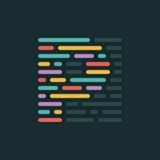
      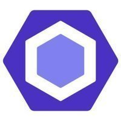
    

  <h2>✨My projects✨</h2>
  

    <a href='https://667c54f205f23692c4b7a4aa--sensational-florentine-793d9d.netlify.app/' target='_blank'>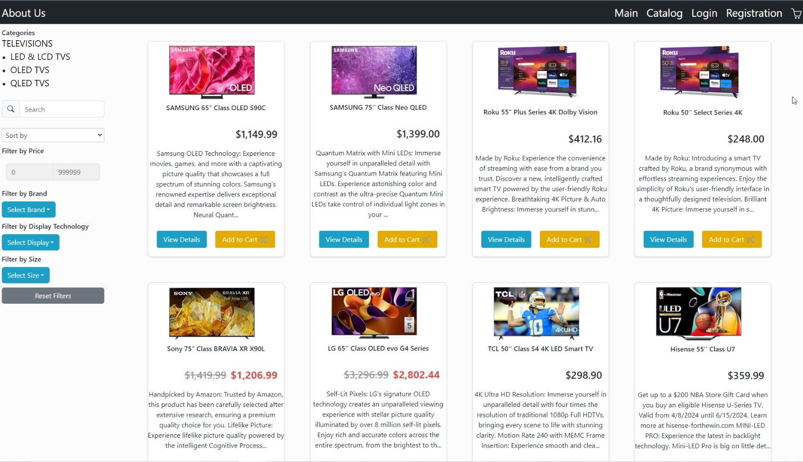</a>
    <a href='https://vlaru.github.io/Travel/' target='_blank'>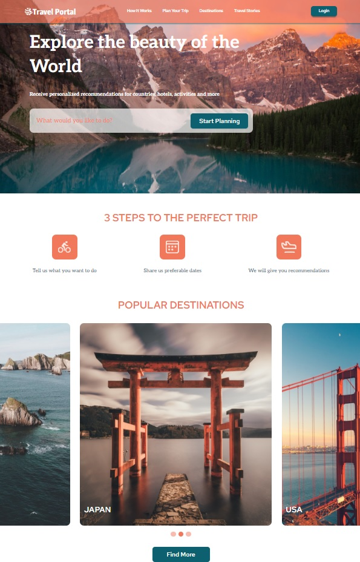</a>
    <a href='https://rolling-scopes-school.github.io/vlaru-JSFE2023Q4/nonogram/' target='_blank'>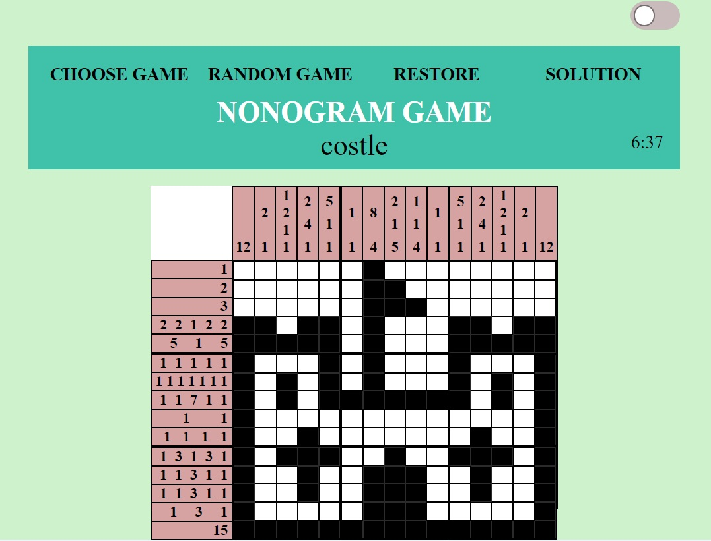</a>
    <a href='https://rolling-scopes-school.github.io/vlaru-JSFE2023Q4/hangman/index.html' target='_blank'>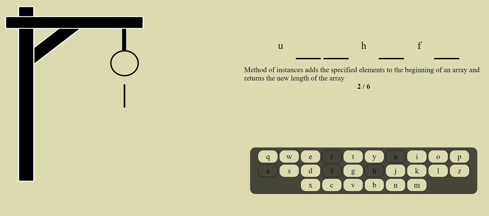</a>
    <a href='https://rolling-scopes-school.github.io/vlaru-JSFE2022Q3/songbird/quiz.html' target='_blank'>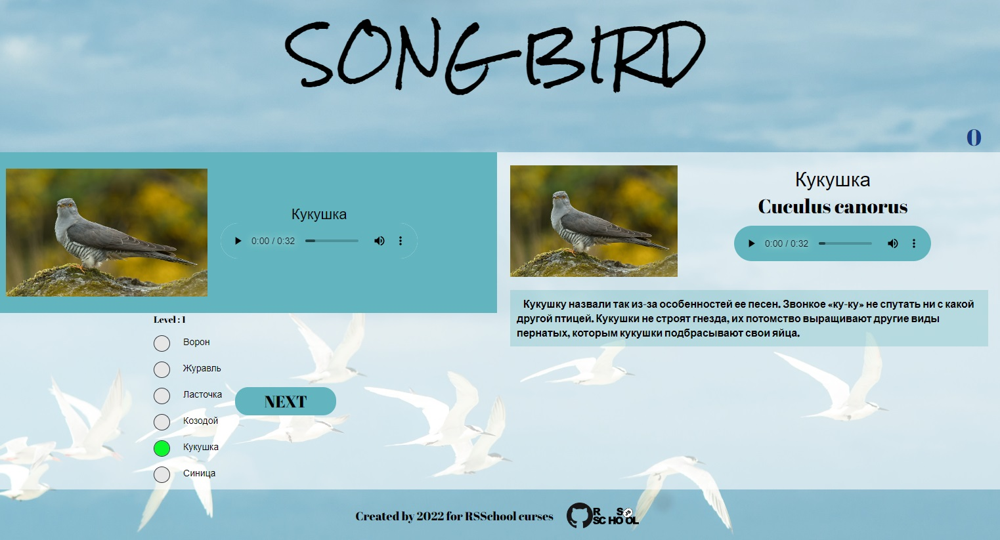</a>
    <a href='https://vermillion-souffle-27bbf8.netlify.app/?city=Trzebnica#' target='_blank'>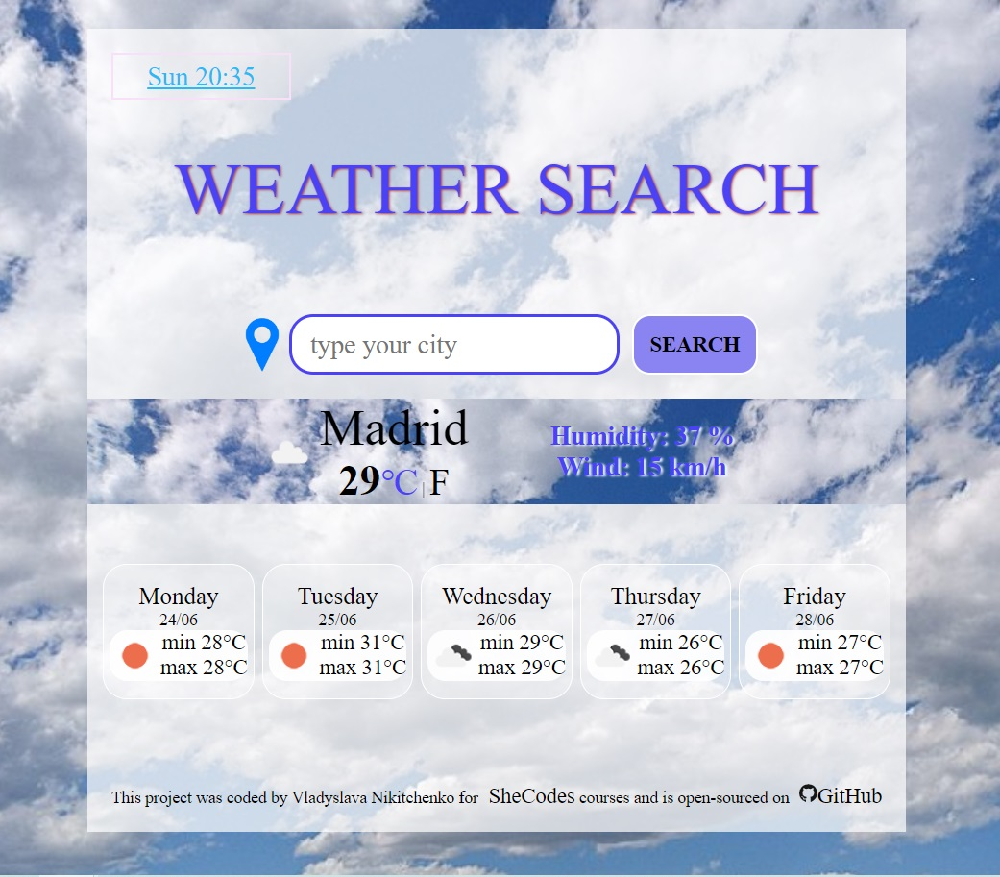</a>
    
    <!--<a href='https://rolling-scopes-school.github.io/vlaru-JSFE2023Q4/rss-puzzle/#start-page' target='_blank'>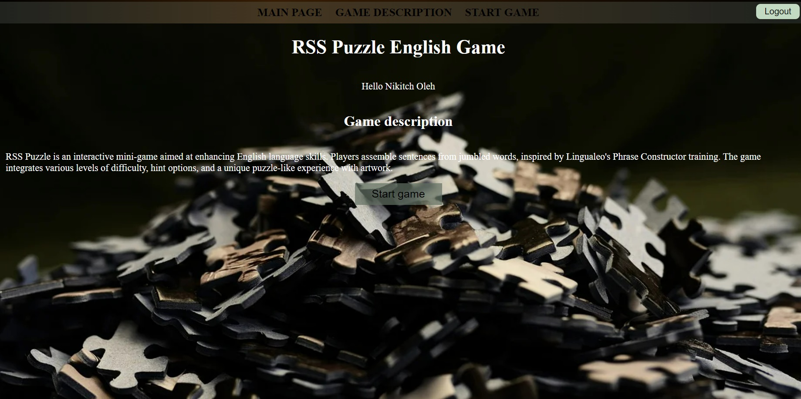</a>-->
  

  <h2>🔥 CodeWars 🔥</h2>
  

### :fire: My Stats :

<h2>My Courses</h2>

  
  
  
  

<h2>Sertificates</h2>

  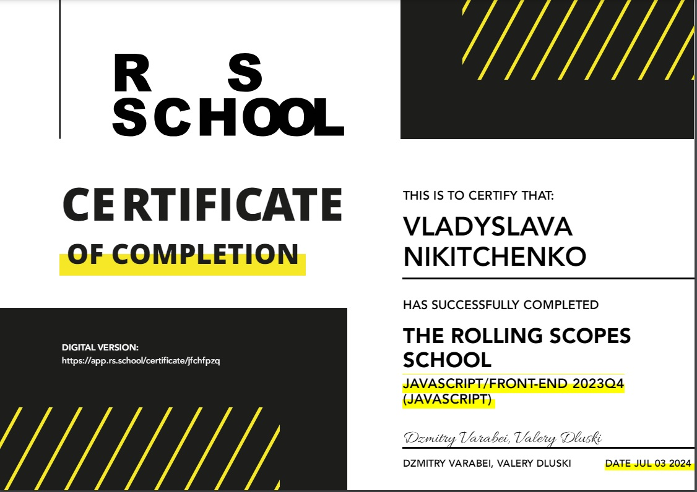
  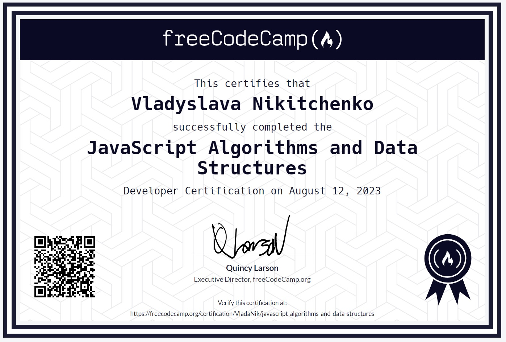
  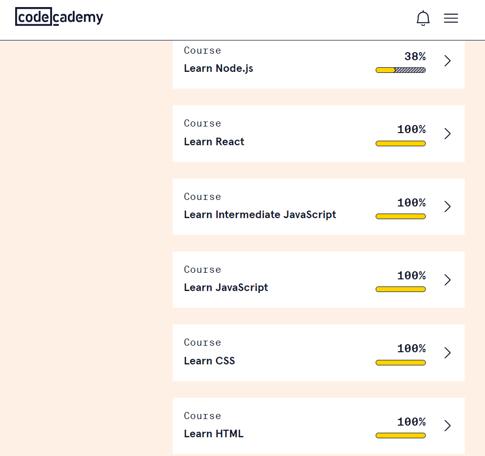
  
  
  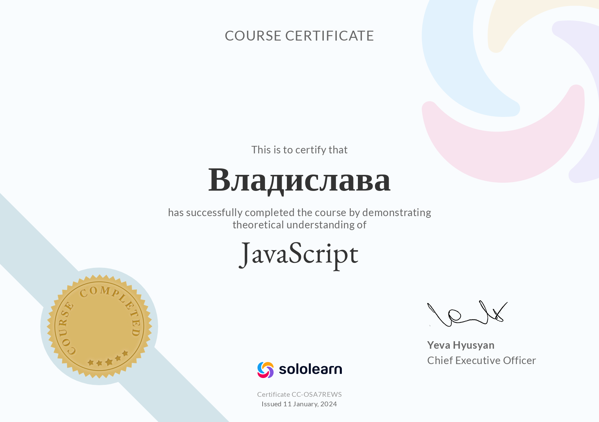
  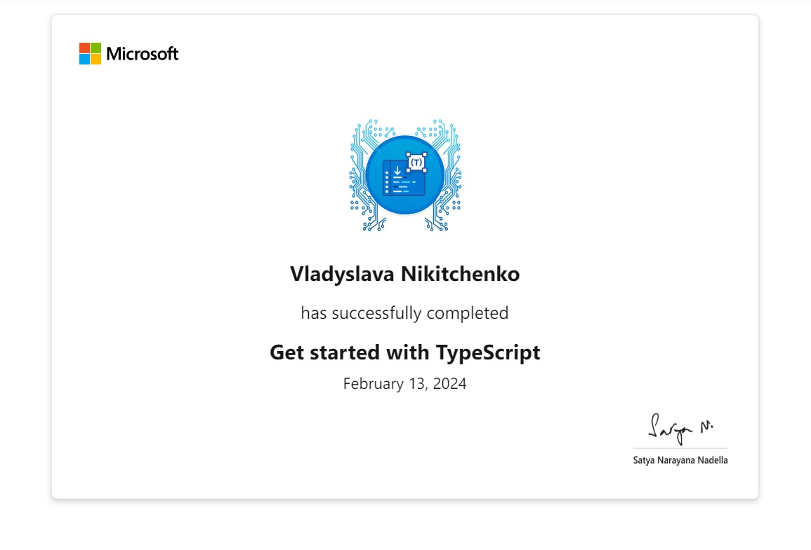

<!--
**VlaRu/VlaRu** is a ✨ _special_ ✨ repository because its `README.md` (this file) appears on your GitHub profile.

Here are some ideas to get you started:

- 🔭 I’m currently working on ...
- 🌱 I’m currently learning ...
- 👯 I’m looking to collaborate on ...
- 🤔 I’m looking for help with ...
- 💬 Ask me about ...
- 📫 How to reach me: ...
- 😄 Pronouns: ...
- ⚡ Fun fact: ...
-->
